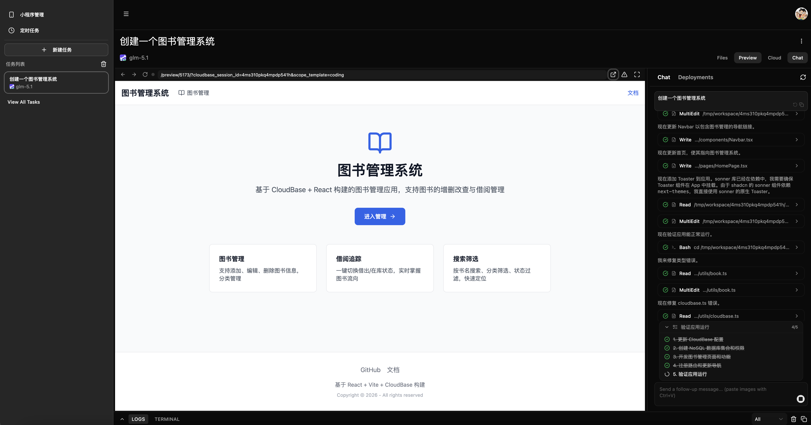
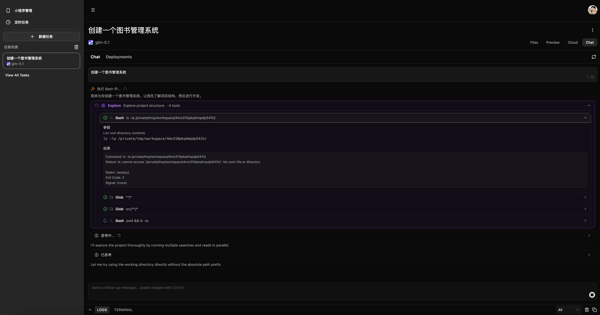
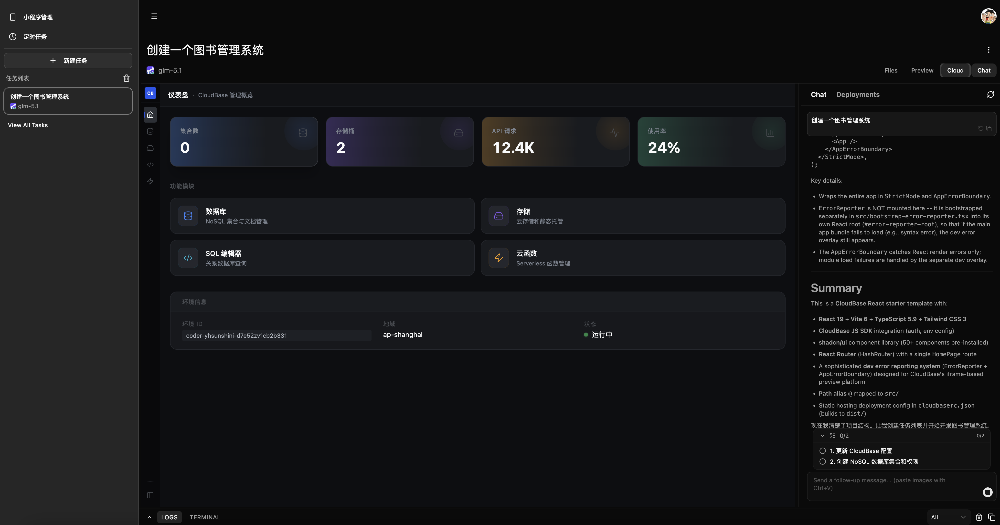
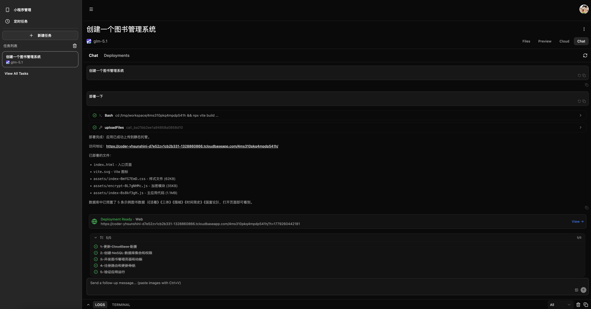
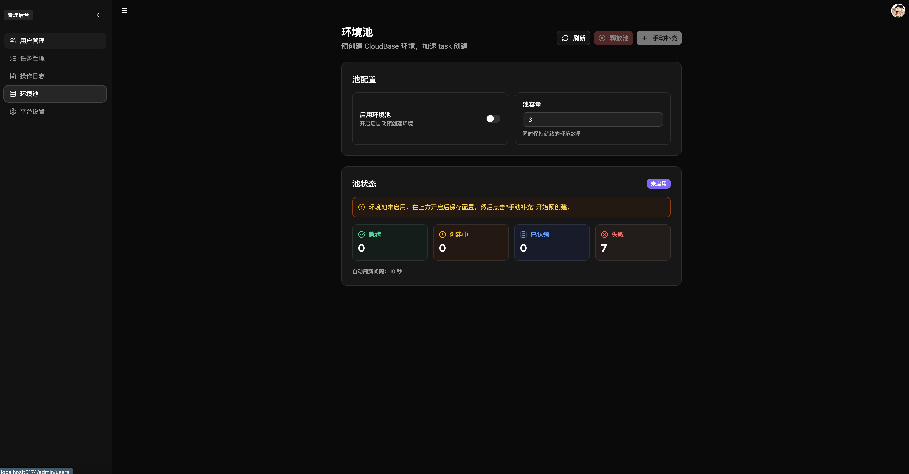

# CloudBase VibeCoding Platform

基于 [coding-agent-template](https://github.com/vercel-labs/coding-agent-template) 重构的 AI 编程助手平台，以腾讯云 CloudBase 为底座，支持多 Agent 运行时、多租户环境隔离与完整的 VibeCoding 工作流。

[](./LICENSE)
[](https://pnpm.io/)
[](https://nodejs.org/)

## 延伸阅读

- [Setup 指南](docs/setup.md) — 初始化流程、环境变量、验证清单与排障
- [系统架构](docs/architecture.md) — 系统分层、模块设计与关键数据流
- [上游分叉与同步](docs/upstream-fork.md) — 硬分叉基线、merge 历史、下次同步命令

---

## At a Glance

| 能力                    | 说明                                                                                                                                 |
| ----------------------- | ------------------------------------------------------------------------------------------------------------------------------------ |
| **多 Agent 运行时**     | CodeBuddy / OpenCode / MiMo 三个 runtime 并行可选；per-agent 独立模型列表；切换时自动校验 selectedModel                              |
| **三级环境隔离**        | `shared`（共用）/ `isolated`（用户独立）/ `task`（任务独立 + 独立 CAM 子账号）三种模式，admin 后台动态切换，无需重启                 |
| **环境池**              | 预创建 CloudBase 环境 + CAM + Policy，获取延迟从分钟级降至毫秒级；池空自动回退实时创建；多 Pod CAS 安全                              |
| **编码模式沙箱**        | 沙箱 infra（Stateful + TRW）；按 envId 单实例复用；`ensureStatefulTool` + 镜像预热；工作区 `/home/user`；预览经 gateway → TRW `/preview/5173/` |
| **Preview Bridge**      | 内嵌 Browser 工具栏（地址栏 / 刷新 / 前进后退 / 设备切换）；OVC 反向代理至 TRW；HMR；预览错误自动修复                                 |
| **Web 终端**            | ttyd 经 TRW `/preview/7681/`，OVC 代理为 `/api/tasks/:id/preview/7681/`                                                              |
| **CloudBase MCP**       | 内置 50+ CloudBase 工具（DB / Storage / Functions / 域名 / 安全规则）；koa 风格 middleware 框架；stdio + HTTP 双模式                 |
| **Human-in-Loop**       | ToolConfirm（四值权限：allow / allow_always / deny / reject_and_exit_plan）；AskUserQuestion 内联表单；消息流内渲染，不打断上下文    |
| **Plan 模式**           | 写操作拦截；PlanModeCard 三按钮（允许执行 / 继续完善 / 拒绝退出）；`planModeAtomFamily` 跨组件状态共享                               |
| **工具渲染注册表**      | 10 个专属渲染器（Bash / Read / Write / Edit / Grep / Glob 等）；Edit 集成 git-diff-view；Subagent 嵌套紫色边框卡片                   |
| **部署能力**            | Web 静态托管 → CDN 链接；微信小程序（异步轮询 jobId）；所有产出统一 `artifact` 事件，Deployments 标签页聚合展示                      |
| **图片生成**            | Default 模式 ImageGen；生成图片自动上传 CloudBase 静态托管，返回 CDN 链接；聊天内 Markdown 内联展示                                  |
| **Git 归档**            | 任务结束（含 error / cancel）自动 git push 到远端，按 `envId` 分支 + `conversationId` 目录存储；内存 credential helper，不泄露 token |
| **CloudBase Dashboard** | task 详情页内嵌 DB / Storage / SQL / Functions 可视化管理；envId 切换自动重置状态，防止旧集合查询污染                                |
| **Admin 后台**          | 用户管理（创建 / 禁用 / API Key 重置）；环境池监控；provision mode 配置；审计日志；资源代理                                          |
| **认证**                | 本地账密 / GitHub OAuth / CloudBase 身份 / API Key（`sak_xxx`）；JWE Cookie 加密会话                                                 |
| **定时任务**            | cron 表达式调度，服务端 `cron-scheduler.ts` 加载执行；分布式锁防重入                                                                 |
| **凭证安全**            | AES-256-CBC 加密存储敏感字段；STS 临时凭证作用域隔离；系统集合 ADMINONLY 规则；日志只允许静态字符串                                  |

---

## Screenshots

**创建任务，选择 Agent 和模型**


**编码模式：左侧对话 + 右侧实时预览**



**Chat 界面：工具调用卡片、Phase 状态指示**



**Human-in-Loop：工具确认 & 向用户提问**

| ToolConfirm                                       | AskUserQuestion                           |
| ------------------------------------------------- | ----------------------------------------- |
|  |  |

**内嵌 CloudBase Dashboard**



**部署完成，查看 artifact**

| Chat 内 artifact                      | Deployments 标签页                |
| ------------------------------------- | --------------------------------- |
|  |  |

**Admin：环境池管理**



---

## 项目结构

```
├── docs/
│   ├── setup.md                  # setup 详解与排障
│   ├── architecture.md           # 系统架构文档
│   └── scf-session-sharing.md    # （历史）SCF Session 共享，stateful 分支已废弃
├── packages/
│   ├── web/                      # React 19 + Vite 前端
│   ├── server/                   # Hono 后端：Auth、Agent 编排、Sandbox 管理
│   ├── dashboard/                # CloudBase 资源管理 UI（DB / Storage / Functions）
│   └── shared/                   # ACP 协议类型、任务 / 消息 schema
├── scripts/
│   ├── init.mjs                  # 交互式初始化脚本
│   └── setup-tcr.mjs             # TCR 镜像仓库配置
└── init.sh                       # 快速入口
```

---

## 快速开始

**前置条件**

开始前请确认：
- **Node.js 22.x**（必需；`better-sqlite3` 原生模块与 server build target 对齐 **node22**，勿用 Node 23+ 或 brew 默认 Node 26）。推荐：`mise use node@22` 或 `nvm use`（根目录 `.nvmrc` 为 `22`）
- pnpm 10+
- Docker 已安装并启动（stateful 分支本地 dev **不**需要本机 TRW；沙箱在云端）
- 已准备 CloudBase 环境和腾讯云 API 密钥
- 已准备 CodeBuddy API Key 或 OAuth 配置

**一键初始化**

```bash
git clone <repository-url>
cd coding-agent-template
./init.sh
```

初始化脚本依次完成：Node.js 检查 → pnpm 安装 → `.env.local` 生成 → Docker 检查 → CloudBase 配置 → 依赖安装 → CodeBuddy 认证 → TCR 配置 → 数据库初始化。

详细步骤与排障见 [docs/setup.md](docs/setup.md)。

---

## 开发

```bash
pnpm dev          # 同时启动 web (localhost:5174) 和 server (localhost:3001)
pnpm dev:web      # 仅启动前端
pnpm dev:server   # 仅启动后端
```

## 生产（本机）

```bash
pnpm build        # 构建所有包
pnpm start        # 启动生产服务（端口 3001，同时服务 API 和静态文件）
```

## 云托管（CloudRun）

OVC 以**容器**部署到 CloudBase 云托管：根目录 `Dockerfile` 构建前后端一体镜像，监听 **80**。

```bash
tcb env use <TCB_ENV_ID>
tcb cloudrun deploy -e <TCB_ENV_ID> -s <服务名> --port 80 --source . --force
```

构建日志与访问地址在控制台「云托管 → 服务详情 → 部署」。环境变量在**同一服务的「服务设置 → 环境变量」**配置（见下节），不要依赖把 `packages/server/.env` 打进镜像（`.dockerignore` 已排除 `.env*`）。

更细的初始化与排障见 [docs/setup.md](docs/setup.md)。

## 常用命令

```bash
# 代码质量
pnpm type-check   # TypeScript 类型检查
pnpm lint         # ESLint
pnpm format       # Prettier 格式化

# 数据库
pnpm db:generate  # 生成迁移
pnpm db:push      # 推送 schema
pnpm db:studio    # 打开 Drizzle Studio

# TCR 镜像仓库
pnpm setup:tcr
pnpm setup:tcr --namespace my-app --local-image node:20

# OpenCode
pnpm opencode:setup   # 配置 OpenCode provider 和模型
```

---

## 环境变量

配置文件分工：

| 文件 | 用途 |
| --- | --- |
| `.env.local` | 根目录；`init.sh` 写入 `JWE_SECRET`、`ENCRYPTION_KEY`、`NEXT_PUBLIC_AUTH_PROVIDERS` 等 |
| `packages/server/.env` | **Server 运行时**（本地 `pnpm dev` / `pnpm start` 读这里；云托管在控制台填同等变量） |

更多字段说明见 [docs/setup.md](docs/setup.md)。

### 沙箱 infra · Tool 模板（`STATEFUL_TOOL_ID` 要不要配？）

**结论：日常开发/上线都不要配 `STATEFUL_TOOL_ID`。** 它只用于调试或运维脚本（`describe-stateful-tool.ts` 等）。

代码里 **Tool 名称是固定的**，由支撑环境 ID 推导：

```text
ToolName = ovc-{TCB_ENV_ID}   # 非法字符会替换为 -，最长 48 字符
```

例如 `TCB_ENV_ID=<your-support-env-id>` → Tool 名 `ovc-<your-support-env-id>`（非法字符会替换为 `-`）。

**正常解析顺序**（`ensureStatefulTool`）：

1. ~~`STATEFUL_TOOL_ID` 环境变量~~ — **仅调试**，会跳过 DB 与创建逻辑，不应写入 `.env`
2. **数据库** — `shared` 模式：`settings.stateful_tool_id`；`isolated` / `task`：`user_resources.statefulToolId`
3. **按名绑定** — 沙箱控制面 `DescribeSandboxToolList`，匹配 `ToolName`，写回 DB
4. **首次创建** — 尚无记录时 `CreateSandboxTool`，使用上述 `ToolName`，再把返回的 `sdt-xxx` 写入 DB

因此：本地第一次跑任务时会创建 Tool 并落库；换机器只要连同一套 CloudBase DB，就会复用同一个 `sdt-xxx`，**不必**在 `.env` 里手写 ToolId。若 DB 被清空但平台上仍有同名 Tool，会先按 `ToolName` 查询再写回 DB。

### 两套「共享 / 隔离」别混

| 维度 | 环境变量 / 配置 | 管什么 | `shared` | `isolated` |
| --- | --- | --- | --- | --- |
| **CloudBase 用户环境** | `TCB_PROVISION_MODE`（init 或 `/admin/settings`） | 用户是否共用**支撑环境**、是否预建 `user_resources` | 全员共用 `TCB_ENV_ID` | 每用户独立 env + CAM |
| **沙箱实例** | `SANDBOX_INSTANCE_MODE`（`packages/server/.env` 或 DB `sandbox_instance_mode`） | **运行时容器**是否跨任务复用 | 同一支撑 env 下多任务共用一个实例 | 每任务独立实例（复用该任务的 `sandboxId`） |

- 本地试 OVC 沙箱行为：改 **`SANDBOX_INSTANCE_MODE`** 即可（`shared` / `isolated`），与是否多租户无关。
- **`TCB_PROVISION_MODE=task`** 时新建任务默认实例模式倾向 `isolated`（见 `sandbox-config.ts`），仍可用 Admin 或 env 覆盖。
- 优先级（实例模式）：DB `sandbox_instance_mode` → env `SANDBOX_INSTANCE_MODE` → 内置默认 `shared`。
- UI 进度文案：`shared` 会出现「复用环境沙箱（多任务共享）」；`isolated` 为「复用任务沙箱」/「为当前任务启动沙箱实例」。

### 沙箱镜像（`STATEFUL_SANDBOX_IMAGE`）

沙箱 infra 首次创建 Tool（`CreateSandboxTool`）需要 **腾讯云 TCR 个人版** 完整 URI（`ccr.ccs.tencentyun.com/<namespace>/<repo>:<tag>`），不能填 Docker Hub / GHCR 直链。

**解析顺序**（`resolveStatefulSandboxImage`，见 `stateful-vibecoding-image.ts`）：

1. `packages/server/.env` 的 **`STATEFUL_SANDBOX_IMAGE`**
2. 同文件或根目录 `.env.local` 的 **`TCR_IMAGE`**（`pnpm setup:tcr` 写入）
3. **代码内置默认**（团队公开 TCR，开箱首次建 Tool）：  
   `ccr.ccs.tencentyun.com/tcb-sandbox-public-cbe88d/tcb-sandbox-public-cbe88d:<tag>`  
   默认 tag 与常量 `VIBECODING_PUBLIC_TCR_DEFAULT_TAG` 同步（当前为带时间的 `…-vibecoding` 后缀，非 `latest`）。

**用你自己的 TCR 镜像（推荐自部署 / 定制 TRW 时）**

1. 在 [腾讯云 TCR 个人版](https://console.cloud.tencent.com/tcr) 创建命名空间，`docker login ccr.ccs.tencentyun.com`（用户名一般为账号 UIN）。
2. 构建 TRW vibecoding 镜像后推送，tag 建议一条龙格式：`YYMMDD-HHMM-<随机>-vibecoding`（见仓库外 `code_sandbox/一条龙.md` § Tag & Push）。
3. 写入 **`packages/server/.env`**（云托管写控制台同等变量）：

```bash
# 二选一即可；显式优先
STATEFUL_SANDBOX_IMAGE=ccr.ccs.tencentyun.com/<your-namespace>/tcb-sandbox-ags:<your-tag>
# 或跑 pnpm setup:tcr 后使用生成的 TCR_IMAGE（会同步到 server .env）
```

也可只写无 tag 的路径，由 `STATEFUL_SANDBOX_IMAGE_TAG` 补默认 tag。首次建 Tool 成功后，镜像 URI 已绑在沙箱 Tool 模板上，**之后可删掉 env**（仍靠 DB / `ovc-{TCB_ENV_ID}` 复用 Tool）。

> **隐私**：勿把 `TCB_SECRET_*`、`TCB_API_KEY`、`CODEBUDDY_API_KEY`、个人 TCR 密码等写入 README 或提交 git；`packages/server/.env` 已在 `.gitignore`。

### 本地开发（`pnpm dev`）

| 变量 | 必需 | 说明 |
| --- | --- | --- |
| `JWE_SECRET` / `ENCRYPTION_KEY` | 是 | 会话与敏感字段加密（`init.sh` 可生成） |
| `TCB_ENV_ID` | 是 | 支撑环境 ID |
| `TCB_SECRET_ID` / `TCB_SECRET_KEY` | 是 | 管理面：建环境、沙箱 Tool/实例、provision |
| `TCB_API_KEY` | 是 | 数据面：gateway 访问 TRW（CloudBase 控制台创建 API Key） |
| `CODEBUDDY_API_KEY` 或 OAuth 一套 | 是 | Agent 调用 |
| `STATEFUL_SANDBOX_IMAGE` | 首次 `CreateSandboxTool` | 见上节；不配则用公开 TCR 默认或 `TCR_IMAGE` |
| `TCR_IMAGE` | 自管镜像时 | `pnpm setup:tcr` 推到**你的**命名空间后写入 |
| `SANDBOX_INSTANCE_MODE` | 否 | `shared`（默认）/ `isolated` — **沙箱实例**是否跨任务复用 |
| `TCB_PROVISION_MODE` | 否 | `shared` / `isolated` / `task` — **CloudBase 用户环境**隔离粒度 |
| `DB_PROVIDER` | 否 | 默认 `cloudbase`；本地纯离线可 `drizzle`（SQLite） |
| `PORT` | 否 | 默认 `3001` |
| `ASK_USER_BASE_URL` | 否 | 默认 `http://127.0.0.1:${PORT}`，OpenCode 子进程回调用 |

**不要配（除非调试）**：`STATEFUL_TOOL_ID`、`STATEFUL_SANDBOX_ID`（固定实例）、`STATEFUL_GATEWAY_URL`（默认 `https://{TCB_ENV_ID}.api.tcloudbasegateway.com/v1/sandbox/-`）。

可选：`GITHUB_*`、`GIT_ARCHIVE_*`、`STATEFUL_MINIPROGRAM_FEATURE`、`STATEFUL_TOOL_WARMUP_*` 等见 [docs/setup.md](docs/setup.md)。

### 云托管（CloudRun）

与本地 **同一套变量名**，在控制台配置；差异主要是运行形态：

| 变量 | 云托管注意点 |
| --- | --- |
| `PORT` | 必须为 **80**（与 `Dockerfile` / `--port 80` 一致） |
| `NODE_ENV` | `production` |
| `JWE_SECRET` / `ENCRYPTION_KEY` | 与本地相同密钥体系，**勿**每次部署随机换（否则已有 session 失效） |
| `TCB_*` / `TCB_API_KEY` / `CODEBUDDY_*` | 与本地相同；Secret 走控制台「环境变量」，不要打进镜像 |
| `ASK_USER_BASE_URL` | 必须设为 **公网可访问的 OVC 根 URL**（如 `https://<云托管默认域名>`），不能依赖默认的 `127.0.0.1` |
| `STATEFUL_SANDBOX_IMAGE` | 首次在该环境创建 Tool 时需要；之后靠 DB 里的 `stateful_tool_id` |
| `STATEFUL_TOOL_ID` | **不要配**（多副本共用 DB 时也应走 DB + ToolName 逻辑） |

云托管不跑 `pnpm dev`：无 Vite 代理，浏览器只访问容器内的 80 端口（静态 + API 一体）。

---

## OpenCode 模型配置

项目内置 OpenCode ACP runtime。如果前端需要使用 OpenCode agent，需要先配置至少一个
provider（model 提供商）。

### 前置：安装 opencode CLI

```bash
npm i -g opencode-ai
# 验证
opencode --version
```

### 一键配置

```bash
pnpm opencode:setup
```

该命令会：

1. 调用 腾讯云开发 AI+ 接口 [DescribeAIModels](https://cloud.tencent.com/document/product/876/131318) 拉取模型
2. 引导并配置腾讯云开发 API Key
3. 从 catalog 取完整配置写入 `.opencode/opencode.json`（含 npm/baseURL/models 等）
4. 把 API Key 写入 `packages/server/.env`

### 生成结果示例

```jsonc
// .opencode/opencode.json（自动生成，字段从 models.dev 获取）
{
  "$schema": "https://opencode.ai/config.json",
  "model": "cloudbase/deepseek-v4-flash",
  "provider": {
    "cloudbase": {
      "options": {
        "baseURL": "https://envId-xxxxxxx.api.tcloudbasegateway.com/v1/ai/cloudbase",
        "apiKey": "{env:CLOUDBASE_API_KEY}"
      },
      "models": {
        "glm-5": {
          "name": "glm-5"
        },
        // 其他模型
      }
    }
  }
}
```

```bash
# packages/server/.env 会追加 API Key
CLOUDBASE_API_KEY=eyJhbGciOiJS.xxxxxxxx
```

> **为什么写完整字段而不是空对象？** opencode 子进程启动时也需要这些配置。如果只写 `{}`，
> 子进程要自己从 models.dev 拉 catalog 才知道 npm / baseURL / models 等信息，一旦拉取失败
> （网络/超时）就无法正常工作。写入完整字段让配置自包含，不依赖运行时网络请求。

### 高级：自定义 provider / 覆盖字段

如果需要：

- 非 catalog 内置的 provider（如内网 LLM 网关、本地 Ollama）
- 覆盖 catalog 默认的 `baseURL` / `headers`（如走国内镜像）
- 用 `whitelist` / `blacklist` 限制要展示的模型
- 配置 variants（如 Anthropic 的 thinking 预算）

请参考 `.opencode/opencode.example.json` 和 [OpenCode 官方 providers 文档](https://opencode.ai/docs/zh-cn/providers/)
直接手动编辑 `.opencode/opencode.json`。

> 提示：`opencode.json` 顶部的 `$schema` 字段让 VS Code / Cursor 等编辑器支持字段自动补全
> 和悬停文档，编辑时按 Ctrl+Space 可查看所有可选字段。

### 重新配置 / 新增 provider

`pnpm opencode:setup` 幂等，可多次运行：

- **已存在的 provider** 不会被覆盖（避免丢失手动调整）
- **已设置的 env key** 不会被重复询问
- **缺失 env 的 provider** 会在启动时提示补齐

## CodeBuddy 模型配置

项目默认使用 CodeBuddy（`@tencent-ai/agent-sdk`）官方模型服务。如果需要使用 CloudBase 上的自定义 AI 模型（如 DeepSeek、混元等），可通过以下方式配置。

### 一键配置

```bash
pnpm codebuddy:setup
```

该命令会：

1. 调用 腾讯云开发 AI+ 接口 [DescribeAIModels](https://cloud.tencent.com/document/product/876/131318) 拉取当前环境已开通的模型
2. 检查 `CLOUDBASE_API_KEY`，缺失时引导输入并自动写入 `packages/server/.env`
3. 同时设置 `CODEBUDDY_USE_CUSTOM_MODELS=true`
4. 生成 `packages/server/.config/.codebuddy/models.json` 供 SDK 读取

### 生成结果示例

```jsonc
// packages/server/.config/.codebuddy/models.json（自动生成）
{
  "models": [
    {
      "id": "deepseek-v4-flash",
      "name": "deepseek-v4-flash",
      "vendor": "cloudbase",
      "apiKey": "${CLOUDBASE_API_KEY}",
      "url": "https://envId-xxxxxxx.api.tcloudbasegateway.com/v1/ai/cloudbase",
      "supportsToolCall": true,
      "supportsImages": true
    }
  ],
  "availableModels": ["deepseek-v4-flash"]
}
```

```bash
# packages/server/.env 会自动追加
CLOUDBASE_API_KEY=eyJhbGciOiJS.xxxxxxxx
CODEBUDDY_USE_CUSTOM_MODELS=true
```

> **关于 `${CLOUDBASE_API_KEY}` 占位符**：`models.json` 中的 `apiKey` 字段使用 `${VAR_NAME}` 语法，
> 由 `@tencent-ai/agent-sdk` 在运行时解析为对应的环境变量值，避免将敏感密钥硬编码到配置文件中。

### 同步与自定义模型

`pnpm codebuddy:setup` 幂等，可多次运行：

- **CloudBase 模型以 API 返回为准**：如果你在 CloudBase 控制台新增或删除了模型，重新运行脚本会同步更新 `models.json`
- **已设置的 env key** 不会被重复询问

### 手动添加自定义模型

如需接入非 CloudBase 的模型（如本地 Ollama、私有 LLM 网关），可直接编辑：

```bash
packages/server/.config/.codebuddy/models.json
```

在 `models` 数组中添加自定义条目（注意 `vendor` 不要写 `cloudbase`，避免被同步覆盖）：

```json
{
  "id": "my-custom-model",
  "name": "My Custom Model",
  "vendor": "custom",
  "apiKey": "${MY_API_KEY}",
  "url": "https://my-llm-gateway.example.com/v1/chat/completions",
  "supportsToolCall": true,
  "supportsImages": false
}
```

同时确保在 `packages/server/.env` 中提供对应的环境变量，并设置：

```bash
CODEBUDDY_USE_CUSTOM_MODELS=true
```

## 技术栈

| 层      | 技术                                                    |
| ------- | ------------------------------------------------------- |
| 前端    | React 19, Vite, Tailwind CSS 4, shadcn/ui, Jotai        |
| 后端    | Hono, Node.js, Drizzle ORM                              |
| 数据库  | CloudBase DB（主），SQLite（本地回退）                  |
| AI      | `@tencent-ai/agent-sdk` (CodeBuddy), OpenCode ACP, MiMo |
| Sandbox | 沙箱 infra（Stateful + TRW）, TCR 镜像                  |
| 认证    | JWE session, bcrypt, Arctic (OAuth)                     |
| 持久化  | CloudBase DB, 本地 .jsonl, Git archive                  |
| 协议    | ACP (JSON-RPC 2.0 + SSE), MCP (Model Context Protocol)  |

完整的模块设计、数据流与 API 路由见 [docs/architecture.md](docs/architecture.md)。

---

## 与上游的关系

- 最初模板：[vercel-labs/coding-agent-template](https://github.com/vercel-labs/coding-agent-template)
- **直接上游**：[TencentCloudBase/OpenVibeCoding](https://github.com/TencentCloudBase/OpenVibeCoding)（`origin`）

**硬分叉基线**（不变）：`43c3e6038d833481c2fd0d4d206f4a801de7a750`（2026-05-21，`feautre/env-pool` 合入点）。本线此后增加沙箱 infra，与上游 **不保证长期可 merge**。

**最近一次上游同步**（2026-05-21）：`git merge origin/main`，已对齐至上游 `main` 的 `a878ddb`（CodeBuddy TokenHub、自定义模型、`codebuddy-setup`、agent 选项等）。完整记录见 [docs/upstream-fork.md](docs/upstream-fork.md)。

|          | 上游 `main`（已 merge 部分） | 本线独有（`feature/stateful-infra`）     |
| -------- | ---------------------------- | ---------------------------------------- |
| Agent    | TokenHub、自定义模型、选项更新 | 同左（已并入）                           |
| Sandbox  | 环境池 / 演进中              | 沙箱 infra（Stateful + TRW）、公开 TCR 默认 |
| 实例策略 | shared / isolated / task     | + `SANDBOX_INSTANCE_MODE`、细粒度进度文案 |

---

## Contributing

1. Fork 并创建功能分支 (`git checkout -b feature/xxx`)
2. 开发完成后确保通过：`pnpm type-check && pnpm lint && pnpm format`
3. 提交 Pull Request

**日志安全规则**：所有 `logger.*` / `console.*` 调用必须使用静态字符串，不得包含 `${动态值}`。详见 [AGENTS.md](./AGENTS.md)。

## Acknowledgments

- [coding-agent-template](https://github.com/vercel-labs/coding-agent-template) by Vercel
- [CloudBase](https://cloudbase.net/) — 云开发基础设施
- [CodeBuddy](https://copilot.tencent.com/) — AI 编程助手
- [Hono](https://hono.dev/) — 轻量级 Web 框架

## License

基于 [coding-agent-template](https://github.com/vercel-labs/coding-agent-template) (Copyright 2025 Vercel, Inc.) 改造，沿用 Apache License 2.0。详见 [LICENSE](./LICENSE) 和 [NOTICE](./NOTICE)。
