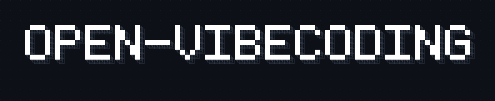

<p align="center">
  
</p>

<p align="center">
  An open-source AI full-stack app platform built on Tencent CloudBase — conversational code generation, live preview, one-click deployment.
</p>

<p align="center">
  <a href="./LICENSE"></a>
  <a href="https://pnpm.io/"></a>
  <a href="https://nodejs.org/"></a>
  <a href="https://www.typescriptlang.org/"></a>
  <a href="https://cloudbase.net/"></a>
</p>

<p align="center">
  <a href="#quick-start">Quick Start</a> ◆
  <a href="./docs/architecture.md">Architecture</a> ◆
  <a href="./docs/setup.md">Deployment</a> ◆
  <a href="./README-zh.md">中文</a>
</p>

---

## Overview

An open-source alternative to [Lovable](https://lovable.dev) / [v0](https://v0.dev) / [bolt.new](https://bolt.new) — an AI full-stack app development platform built on Tencent CloudBase. Conversational code generation, live preview, one-click deployment, with dual Agent runtimes (CodeBuddy / OpenCode) and three-tier environment isolation.

**AI generation process**

<video src="https://github.com/user-attachments/assets/504721f8-bf14-4f16-a8b0-a7d5829c503c" controls width="100%"></video>

**Application showcase**

<video src="https://github.com/user-attachments/assets/750b67cd-551c-4795-bc8c-cfacc0fb23b4" controls width="100%"></video>

---

## Why this project

|                       | Lovable / v0 / bolt.new   | This project                                                              |
| --------------------- | ------------------------- | ------------------------------------------------------------------------- |
| Source code           | Closed-source SaaS        | Fully open-source (Apache 2.0), self-hostable                             |
| Pricing               | Usage-based / subscription| Bring your own cloud resources, cost-controllable                         |
| Infrastructure        | Vendor-locked             | Tencent CloudBase (DB / Storage / Functions / CDN)                        |
| Agent engine          | Single built-in model     | CodeBuddy + OpenCode dual engines, free model switching                   |
| Environment isolation | User-level only           | shared / isolated / task three-tier isolation, multi-tenant ready         |
| Sandbox               | Platform-managed          | CloudBase AGS Stateful + 沙箱业务镜像 (TCR images), gateway data plane              |
| Cloud resource ops    | None / limited            | MCP tools operate DB, Storage, Functions, domains directly                |
| Deploy targets        | Platform-hosted only      | Web CDN / WeChat Mini Program / custom domains                            |
| Human-in-the-loop     | Basic chat                | Plan mode + four-value ToolConfirm + inline AskUser form                  |
| Extensibility         | Not extensible            | Monorepo, decoupled frontend/backend, fork-friendly                       |

---

## Feature highlights

| Capability                  | Highlights                                                                                                            |
| --------------------------- | --------------------------------------------------------------------------------------------------------------------- |
| **Dual Agent engines**      | Choose between CodeBuddy and OpenCode, each with its own model list, one-click switch from the UI                     |
| **Three-tier isolation**    | shared / isolated (per user) / task (per-task subaccount), hot-switchable from Admin without restart                  |
| **Environment pool**        | Pre-created CloudBase env + CAM + Policy; acquisition latency drops from minutes to milliseconds; fallback on miss   |
| **Coding sandbox**          | AGS tool/instance per env; 沙箱业务镜像 at `/home/user`; preview `/preview/5173`, terminal ttyd `/preview/7681` via OpenVibeCoding proxy |
| **Live preview**            | Embedded browser toolbar (address bar / nav / refresh); HMR; auto-feedback loop on preview errors                    |
| **CloudBase MCP**           | 50+ tools covering DB, Storage, Functions, domains, security rules — Agent operates cloud resources directly         |
| **Human-in-Loop**           | Four-value tool confirmation (allow / always / deny / exit); inline AskUser form without breaking chat context        |
| **Plan mode**               | Auto-intercepts write operations; three-button decision (execute / refine / reject); cross-component state sharing    |
| **Tool rendering**          | 10 dedicated renderers (Bash / Read / Write / Edit / Grep / Glob, etc.); Edit ships with built-in git-diff view       |
| **One-click deploy**        | Web static hosting → CDN; async WeChat Mini Program deploy; unified artifact aggregated in Deployments tab            |
| **Image generation**        | AI-generated images auto-uploaded to CloudBase hosting; CDN URL returned; rendered inline as Markdown                 |
| **Git archive**             | Auto-push to remote on task end; branch by envId + directory by conversationId; in-memory credentials, no token leak  |
| **Resource dashboard**      | Embedded DB / Storage / SQL / Functions management inside the task detail page                                        |
| **Admin console**           | User management, env pool monitoring, provision mode config, audit logs                                               |
| **Scheduled tasks**         | Cron scheduling + distributed lock to prevent re-entry                                                                |
| **Credential security**     | AES-256-CBC encrypted storage; STS scoped temporary credentials; logs restricted to static strings only               |

---

## Screenshots

**Create a task, pick agent and model**


**Coding mode: chat on the left, live preview on the right**


**Chat UI: tool-call cards, phase indicator**


**Human-in-Loop: tool confirmation & asking the user**

| ToolConfirm                                       | AskUserQuestion                           |
| ------------------------------------------------- | ----------------------------------------- |
|  |  |

**Embedded CloudBase Dashboard**


**Deployment complete, view artifact**

| Artifact in chat                       | Deployments tab                    |
| -------------------------------------- | ---------------------------------- |
|   |   |

**Admin: environment pool management**


---

## Quick Start

Env files are **split on purpose** — do not use `.env.cloud` for `pnpm dev` or bake `.env.local` into the cloud image.

| | Local development | Deploy to CloudRun |
| --- | --- | --- |
| **Init** | `./init.sh` → **1** → `.env.local` | `./init.sh` → **2** → `.env.cloud` |
| **Command** | `pnpm dev` | `pnpm deploy:cloud` |
| **URL** | Web `http://localhost:5174`, API `:3001` | Default domain `https://*.sh.run.tcloudbase.com` |
| **Port** | `PORT=3001` | Container listens on **80** (not 9000; 9000 is sandbox TRW only) |
| **Docs** | [docs/setup.md](docs/setup.md) | [docs/cloudrun-deploy.md](docs/cloudrun-deploy.md) |

Need both paths: run `./init.sh` twice (option 1, then option 2). Template: [.env.example](.env.example).

```bash
git clone https://github.com/TencentCloudBase/OpenVibeCoding.git
cd OpenVibeCoding
./init.sh

# macOS / Linux / Git Bash / WSL — or: node scripts/init.mjs (Windows)

pnpm dev            # local
pnpm deploy:cloud   # cloud (requires @cloudbase/cli)
```

---

## Development

**Uses `.env.local` only.** Coding sandboxes run in CloudBase Stateful + 沙箱业务镜像, not in local Docker for normal tasks.

```bash
pnpm dev          # Web :5174 + API :3001
pnpm dev:web      # Frontend only
pnpm dev:server   # Backend only
pnpm build && pnpm start   # Local prod-shaped run (not CloudRun)
```

## Deploy to CloudRun

**Separate from local dev.** Reads **`.env.cloud`**, uploads source via CloudBase CLI, builds `Dockerfile` in the cloud.

**Prerequisites**

- `./init.sh` option **2** → `.env.cloud` with `TCB_SECRET_*`, `TCB_ENV_ID`
- `npm i -g @cloudbase/cli` and `cloudbase login`
- `ASK_USER_BASE_URL` may be a placeholder first; deploy writes back `https://…sh.run.tcloudbase.com` when available

**Run in a real terminal** (upload can take minutes; IDE agents may time out).

```bash
pnpm deploy:cloud
```

The script: prints the console link immediately → uploads source (15s heartbeat) → polls until the release settles → may write back `ASK_USER_BASE_URL` → tries to sync env to the service (`--skip-env-sync` to skip).

| Flag | Meaning |
| --- | --- |
| `--no-wait` | Submit only, no status polling |
| `--skip-env-sync` | Do not push `.env.cloud` to CloudRun env |

Service **`vibecoding-platform`**, public port **80**. Details: [docs/cloudrun-deploy.md](docs/cloudrun-deploy.md).

## Common commands

```bash
# Code quality
pnpm type-check   # TypeScript type-check
pnpm lint         # ESLint
pnpm format       # Prettier

# Database
pnpm db:generate  # Generate migrations
pnpm db:push      # Push schema
pnpm db:studio    # Open Drizzle Studio

# TCR image registry
pnpm setup:tcr
pnpm setup:tcr --namespace my-app --local-image node:20

# OpenCode
pnpm opencode:setup   # Configure OpenCode provider and models
```

---

## Project structure

```
├── docs/
│   ├── setup.md                  # Setup walkthrough & troubleshooting
│   ├── architecture.md           # System architecture
│   ├── cloudrun-deploy.md        # CloudRun deploy & env
│   ├── upstream-fork.md          # Fork baseline & sync
│   └── scf-session-sharing.md    # (legacy) SCF session sharing
├── packages/
│   ├── web/                      # React 19 + Vite frontend
│   ├── server/                   # Hono backend: Auth, Agent orchestration, Sandbox
│   ├── dashboard/                # CloudBase resource UI (DB / Storage / Functions)
│   └── shared/                   # ACP protocol types, task / message schemas
├── scripts/
│   ├── init.mjs                  # Interactive init script
│   ├── deploy.mjs                # CloudRun one-click deploy
│   └── setup-tcr.mjs             # TCR image registry setup
└── init.sh                       # Quick entry
```

---

## Tech stack

| Layer    | Stack                                                  |
| -------- | ------------------------------------------------------ |
| Frontend | React 19, Vite, Tailwind CSS 4, shadcn/ui, Jotai       |
| Backend  | Hono, Node.js, Drizzle ORM                             |
| Database | CloudBase DB (primary), SQLite (local fallback)        |
| AI       | `@tencent-ai/agent-sdk` (CodeBuddy), OpenCode ACP      |
| Sandbox  | CloudBase AGS Stateful + 沙箱业务镜像, TCR images               |
| Auth     | JWE session, bcrypt, Arctic (OAuth)                    |
| Storage  | CloudBase DB, local .jsonl, Git archive                |
| Protocol | ACP (JSON-RPC 2.0 + SSE), MCP (Model Context Protocol) |

Full module design, data flow, and API routes are in [docs/architecture.md](docs/architecture.md).

---

## Environment variables

Full variable reference is in [docs/setup.md](docs/setup.md). Core variables:

```env
# Encryption keys (auto-generated by init script)
JWE_SECRET=
ENCRYPTION_KEY=

# Auth
NEXT_PUBLIC_AUTH_PROVIDERS=local   # local | github | cloudbase

# CloudBase
TCB_SECRET_ID=
TCB_SECRET_KEY=
TENCENTCLOUD_ACCOUNT_ID=
TCB_ENV_ID=
TCB_PROVISION_MODE=shared          # shared | isolated | task

# TCR
TCR_NAMESPACE=
TCR_PASSWORD=
TCR_IMAGE=

# Optional
MAX_MESSAGES_PER_DAY=50
MAX_SANDBOX_DURATION=300
ANTHROPIC_API_KEY=
OPENAI_API_KEY=
GEMINI_API_KEY=
```

---

## OpenCode model configuration

The project ships with an OpenCode ACP runtime. To use the OpenCode agent from the frontend, configure at least one model provider first.

### Prerequisite: install the opencode CLI

```bash
npm i -g opencode-ai
# verify
opencode --version
```

### One-shot setup

```bash
pnpm opencode:setup
```

The command will:

1. Call the Tencent CloudBase AI+ endpoint [DescribeAIModels](https://cloud.tencent.com/document/product/876/131318) to fetch models
2. Walk you through configuring the Tencent CloudBase API Key
3. Take the complete config from the catalog and write it to `.opencode/opencode.json` (including npm / baseURL / models)
4. Append the API Key to `.env.local`

### Example output

```jsonc
// .opencode/opencode.json (auto-generated; fields pulled from models.dev)
{
  "$schema": "https://opencode.ai/config.json",
  "model": "cloudbase/deepseek-v4-flash",
  "provider": {
    "cloudbase": {
      "options": {
        "baseURL": "https://envId-xxxxxxx.api.tcloudbasegateway.com/v1/ai/cloudbase",
        "apiKey": "{env:CLOUDBASE_API_KEY}"
      },
      "models": {
        "glm-5": {
          "name": "glm-5"
        }
      }
    }
  }
}
```

```bash
# .env.local gets the API Key appended
CLOUDBASE_API_KEY=eyJhbGciOiJS.xxxxxxxx
```

> **Why write the full fields instead of an empty object?** The opencode child process also needs these settings on startup. With just `{}`, the child would have to fetch the catalog from models.dev itself to learn npm / baseURL / models, and a network failure would break it. Writing the full fields makes the config self-contained, with no runtime network dependency.

### Advanced: custom provider / overrides

If you need to:

- Use a provider not in the built-in catalog (e.g. an internal LLM gateway, local Ollama)
- Override the catalog's default `baseURL` / `headers` (e.g. route through a regional mirror)
- Restrict which models are exposed via `whitelist` / `blacklist`
- Configure variants (e.g. Anthropic thinking budget)

Refer to `.opencode/opencode.example.json` and the [OpenCode providers docs](https://opencode.ai/docs/providers/) and edit `.opencode/opencode.json` manually.

> Tip: the `$schema` field at the top of `opencode.json` enables auto-completion and hover docs in VS Code / Cursor — press Ctrl+Space while editing to inspect all available fields.

### Re-running / adding providers

`pnpm opencode:setup` is idempotent and can be run multiple times:

- **Existing providers** are not overwritten (to preserve manual tweaks)
- **Already-set env keys** are not asked for again
- **Providers with missing env** are flagged at startup

## CodeBuddy model configuration

By default the project uses CodeBuddy's (`@tencent-ai/agent-sdk`) official model service. To use custom AI models on CloudBase (e.g. DeepSeek, Hunyuan), configure as below.

### One-shot setup

```bash
pnpm codebuddy:setup
```

The command will:

1. Call the Tencent CloudBase AI+ endpoint [DescribeAIModels](https://cloud.tencent.com/document/product/876/131318) to fetch models enabled in the current environment
2. Check for `CLOUDBASE_API_KEY`; if missing, prompt for input and write it to `.env.local`
3. Also set `CODEBUDDY_USE_CUSTOM_MODELS=true`
4. Generate `packages/server/.config/.codebuddy/models.json` for the SDK to read

### Example output

```jsonc
// packages/server/.config/.codebuddy/models.json (auto-generated)
{
  "models": [
    {
      "id": "deepseek-v4-flash",
      "name": "deepseek-v4-flash",
      "vendor": "cloudbase",
      "apiKey": "${CLOUDBASE_API_KEY}",
      "url": "https://envId-xxxxxxx.api.tcloudbasegateway.com/v1/ai/cloudbase",
      "supportsToolCall": true,
      "supportsImages": true
    }
  ],
  "availableModels": ["deepseek-v4-flash"]
}
```

```bash
# .env.local gets auto-appended
CLOUDBASE_API_KEY=eyJhbGciOiJS.xxxxxxxx
CODEBUDDY_USE_CUSTOM_MODELS=true
```

> **About the `${CLOUDBASE_API_KEY}` placeholder**: the `apiKey` field in `models.json` uses `${VAR_NAME}` syntax, resolved at runtime by `@tencent-ai/agent-sdk` to the corresponding env value — avoids hard-coding secrets in config files.

### Syncing & custom models

`pnpm codebuddy:setup` is idempotent:

- **CloudBase models follow the API** — if you add or remove models in the CloudBase console, re-running the script syncs `models.json`
- **Already-set env keys** are not asked for again

### Manually adding custom models

To plug in non-CloudBase models (e.g. local Ollama, private LLM gateway), edit:

```bash
packages/server/.config/.codebuddy/models.json
```

Append a custom entry to the `models` array (note: do **not** set `vendor` to `cloudbase`, or the sync will overwrite it):

```json
{
  "id": "my-custom-model",
  "name": "My Custom Model",
  "vendor": "custom",
  "apiKey": "${MY_API_KEY}",
  "url": "https://my-llm-gateway.example.com/v1/chat/completions",
  "supportsToolCall": true,
  "supportsImages": false
}
```

Make sure the matching env variable is defined in `.env.local`, and set:

```bash
CODEBUDDY_USE_CUSTOM_MODELS=true
```

---

## Further reading

- [Setup guide](docs/setup.md) — init flow, env variables, verification checklist, troubleshooting
- [Architecture](docs/architecture.md) — system layers, module design, key data flows
- [SCF session sharing](docs/scf-session-sharing.md) — sandbox session reuse design

---

## Contributing

1. Fork and create a feature branch (`git checkout -b feature/xxx`)
2. Before submitting, make sure these pass: `pnpm type-check && pnpm lint && pnpm format`
3. Open a Pull Request

**Logging safety rule**: every `logger.*` / `console.*` call must use static strings only — no `${dynamic values}`. See [AGENTS.md](./AGENTS.md).

## Acknowledgments

- [coding-agent-template](https://github.com/vercel-labs/coding-agent-template) by Vercel
- [CloudBase](https://cloudbase.net/) — cloud development infrastructure
- [CodeBuddy](https://copilot.tencent.com/) — AI Agent
- [Hono](https://hono.dev/) — lightweight web framework

## License

Derived from [coding-agent-template](https://github.com/vercel-labs/coding-agent-template) (Copyright 2025 Vercel, Inc.) under Apache License 2.0. See [LICENSE](./LICENSE) and [NOTICE](./NOTICE).
