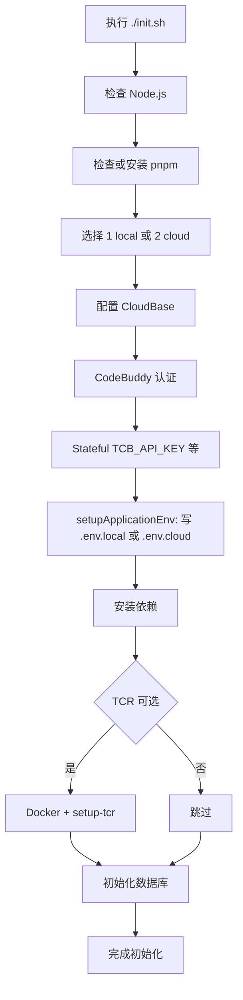

# Setup 指南

本文档补充根目录 `README.md` 中的 setup 说明，重点覆盖：
- 前置条件
- `./init.sh` 与 `scripts/init.mjs` 的实际执行流程
- 关键环境变量职责
- 初始化完成后的验证方式
- 常见问题排障

## 前置条件

### 必需项
- **Node.js 22.x**（`>=22 <23`）。`packages/server` 使用 `better-sqlite3` 与 `tsup --target node22`；更高主版本（如 26）会导致原生模块 ABI 不匹配或安装失败。根目录 `.nvmrc` 为 `22`；可用 `mise use node@22` / `nvm use`。
- pnpm 10+
- Docker **仅在你选择 init 里的 TCR 推镜像时需要**（日常 Stateful 开发不需要）
- 腾讯云账号，且已准备 CloudBase 环境
- 可用的腾讯云 API 密钥（`SecretId` / `SecretKey`）
- 至少一种 CodeBuddy 认证方式：
  - API Key
  - OAuth（企业旗舰版）

### 可选项
- GitHub OAuth 配置
- Git Archive（CNB）归档配置
- 自定义 TCR 命名空间、镜像名和标签

## 推荐初始化方式

### 方式 1：使用入口脚本（macOS / Linux / Git Bash / WSL）

```bash
git clone <repository-url>
cd coding-agent-template
./init.sh
```

`init.sh` 会先做基础检查（Node.js、pnpm），然后委托 `scripts/init.mjs` 完成交互式初始化。

> Windows 用户：可以使用 **Git Bash** 或 **WSL2** 运行上面的命令，与 macOS / Linux 一致。

### 方式 2：直接执行主脚本（跨平台，推荐 Windows 用户使用）

确认本机已安装 **Node.js >= 18** 和 **pnpm** 后，所有平台都可以直接运行：

```bash
node scripts/init.mjs
```

## 初始化流程总览

当前项目的初始化逻辑以 `scripts/init.mjs` 为准。整体流程如下：



## 各步骤说明

| 步骤 | 脚本位置 | 作用 |
| --- | --- | --- |
| 1 | `init.sh` | 检查 Node.js 与 pnpm 是否可用 |
| 2 | `scripts/init.mjs#promptEnvGenerationTarget` | **二选一**：1) `.env.local` 或 2) `.env.cloud`（无第三项） |
| 3 | `scripts/init.mjs#setupCloudbaseConfig` | 引导输入腾讯云密钥、选择 `TCB_ENV_ID`、设置 `TCB_PROVISION_MODE` |
| 4 | `scripts/init.mjs#setupCodebuddy` | 配置 CodeBuddy API Key 或 OAuth |
| 5 | `scripts/init.mjs#setupStatefulSandbox` | 可选填写 `TCB_API_KEY`、`STATEFUL_SANDBOX_IMAGE` |
| 6 | `scripts/init.mjs#setupApplicationEnv` | 写入步骤 2 选中的那一份 |
| 7 | `scripts/init.mjs#installDependencies` | 执行 `pnpm install`，并尝试重建 `better-sqlite3` |
| 8 | `scripts/init.mjs#setupTcr` | **可选**：仅维护沙箱业务镜像时需要 Docker + TCR |
| 9 | `scripts/init.mjs` 主流程 | 数据库、Git 归档、Skills、自定义模型等 |

## 配置文件职责

| 文件 | 提交 git | 用途 |
| --- | --- | --- |
| `.env.example` | 是 | 字段说明模板 |
| `.env.local` | 否 | 本地开发：`pnpm dev:server` 通过 `--env-file=../../.env.local` 加载 |
| `.env.cloud` | 否 | 云托管运行时：`pnpm deploy:cloud` 同步到服务 EnvParams |

前后端一体：仅 **Node 服务端**读取 env；Vite dev 将 `/api` 代理到 `:3001`，无需第二份密钥文件。

两把加密密钥（均在 `.env.local` / `.env.cloud` 中各一份，值应一致）：
- `JWE_SECRET` — 登录 session
- `ENCRYPTION_KEY` — MCP 连接器密文

### init 生成策略

- 每次 `./init.sh` **只生成一个文件**：选 1 → `.env.local`，选 2 → `.env.cloud`。
- 两个都要：先跑一遍选 1，再跑一遍选 2（CloudBase / CodeBuddy 等步骤会再走一遍）。
- **覆盖**：仅针对本次选中的文件询问；选「否」则跳过写入。
- 选 **2** 时会问 `ASK_USER_BASE_URL`（云托管公网根 URL）；首次部署前可回车用占位，`pnpm deploy:cloud` 在能读到默认域名时会写回 `.env.cloud`。

## 本地开发流程

1. `./init.sh`（或已有 `.env.local`）
2. `pnpm dev` → Web `:5174`，API `:3001`（server 读 `.env.local`）
3. 改 env 后需**重启** server（`--env-file` 只在启动时加载）

详见 README「本地开发」一节。

## 部署到云托管

与本地开发 **完全分开**（不共用 `.env.local`）。详见 [cloudrun-deploy.md](./cloudrun-deploy.md)。

1. `./init.sh` 选 **2** → `.env.cloud`（含 `TCB_SECRET_*`、`TCB_ENV_ID`）
2. `npm i -g @cloudbase/cli` 且 `cloudbase login`
3. 在本机终端执行 `pnpm deploy:cloud`（会先打控制台链接，再上传、轮询；`ASK_USER_BASE_URL` 可从 `*.sh.run.tcloudbase.com` 自动写回）
4. 若 env API 同步失败，到控制台粘贴 `.env.cloud` 中的运行时变量

## 关键环境变量

### CloudBase

| 变量 | 必需 | 说明 |
| --- | --- | --- |
| `TCB_ENV_ID` | 是 | 当前项目使用的 CloudBase 支撑环境 ID |
| `TCB_SECRET_ID` | 是 | 腾讯云 API 密钥 ID |
| `TCB_SECRET_KEY` | 是 | 腾讯云 API 密钥 Key |
| `TCB_REGION` | 否 | 默认是 `ap-shanghai` |
| `TCB_PROVISION_MODE` | 否 | 用户环境模式，支持 `shared` / `isolated` / `task`，默认 `shared` |

### CodeBuddy 认证

| 变量 | 必需 | 说明 |
| --- | --- | --- |
| `CODEBUDDY_API_KEY` | 二选一 | 推荐方式，个人用户可直接使用 |
| `CODEBUDDY_INTERNET_ENVIRONMENT` | 否 | 区分国内版 / 海外版 / iOA |
| `CODEBUDDY_CLIENT_ID` | 二选一 | OAuth 模式下使用 |
| `CODEBUDDY_CLIENT_SECRET` | 二选一 | OAuth 模式下使用 |
| `CODEBUDDY_OAUTH_ENDPOINT` | 否 | OAuth Token 端点，默认使用国内地址 |

### Stateful Sandbox / TCR

| 变量 | 必需 | 说明 |
| --- | --- | --- |
| `TCB_API_KEY` | 是 | gateway 数据面 Bearer（与 `TCB_ENV_ID` 配套） |
| `ENABLE_AUTH_MODE` | 否 | 默认 `false`：`StartSandboxInstance` 使用 `AuthMode: NONE`，数据面仅 gateway 头 |
| `TCB_ACCESS_TOKEN` | 条件 | `ENABLE_AUTH_MODE=true` 时**必填**（`sit_*`）；server 请求加 `X-Access-Token`，起实例不传 `NONE` |
| `STATEFUL_SANDBOX_IMAGE` | 否 | 首次 `CreateSandboxTool` 或镜像漂移 reconcile；不配则用公开 TCR 默认或 `TCR_IMAGE` |
| `TCR_IMAGE` | 否 | `pnpm setup:tcr` 写入你的命名空间 |
| `SANDBOX_TTL_SECONDS` | 否 | AGS 实例超时（**秒**），默认 `1800`（30m）；写入 `StartSandboxInstance.Timeout` 与 `CreateSandboxTool.DefaultTimeout` |
| `WORKSPACE_ISOLATION` | 否 | `shared` / `isolated` — 沙箱**实例**是否跨任务复用（与 main 同名） |
| `MAX_SANDBOX_DURATION` | 否 | 任务字段默认上限（**秒**，默认 300）；**不**控制 AGS Stop，与 `SANDBOX_TTL_SECONDS` 无关 |
| `GIT_ARCHIVE_*` | 否 | 工作区归档；实例就绪后 `PUT /api/workspace/env` 注入（非 Start 时传 boot env） |
| `STATEFUL_PUBLIC_TCR_REPOSITORY` | 否 | 公开 TCR 仓库名，默认 `tcb-sandbox-public-cbe88d` |

**网关**：固定 `https://{TCB_ENV_ID}.api.tcloudbasegateway.com/v1/sandbox/-`，无 env 覆盖。

**数据面鉴权（两层）**：`X-Cloudbase-Authorization`（`TCB_API_KEY`）始终需要；开启 `ENABLE_AUTH_MODE` 后还需 `X-Access-Token`（`TCB_ACCESS_TOKEN`，来自 AGS `AcquireSandboxInstanceToken`）。`ENABLE_AUTH_MODE` 会通过 `PUT /api/workspace/env` 注入沙箱业务镜像（不含 token）。

**小程序**：沙箱业务镜像 `/api/jobs/miniprogram-deploy` **默认开启**，无需 env 开关。

**镜像**：须为 `ccr.ccs.tencentyun.com/...`（沙箱 infra 使用 TCR 个人版，`ImageRegistryType: personal`）。团队公开默认见 `packages/server/src/sandbox/stateful-vibecoding-image.ts`；自部署用自有命名空间推送后设 `STATEFUL_SANDBOX_IMAGE` 或跑 `pnpm setup:tcr`。勿在文档或 git 中提交 API Key / TCR 密码。

### 沙箱实例模式（`WORKSPACE_ISOLATION`）

与 **`TCB_PROVISION_MODE`（用户 CloudBase 环境）** 独立，详见 [README-zh.md](../README-zh.md) 环境变量一节。

| 值 | 行为 |
| --- | --- |
| `shared`（默认） | 同一支撑 `TCB_ENV_ID` 下，多任务复用沙箱 infra 上同一运行实例（`ensureSingleEnvInstance`） |
| `isolated` | 每任务独立实例；优先复用任务上的 `sandboxId`，否则新建 |

配置位置：`.env.local` 的 `WORKSPACE_ISOLATION`；Admin「系统设置」里的 `sandbox_instance_mode`（DB）优先级更高。改模式后**新建任务**最可靠；旧任务若 DB 里已写死 `sandboxMode` 可能仍为旧值。

## 用户环境模式

初始化时需要选择 `TCB_PROVISION_MODE`，也可在 `/admin/settings` 运行时动态切换。

### `shared`
- 默认推荐模式
- 所有用户复用同一个 CloudBase 环境
- 配置简单，适合个人使用或快速试用

### `isolated`
- 每个用户单独分配独立 CloudBase 环境 + CAM 子账号
- 对账号余额、权限和环境创建能力有更高要求
- 适合多用户 SaaS 部署

### `task`
- 每个任务创建独立 CloudBase 环境 + 独立 CAM 子账号（`vibe_t_{taskId}`）
- 任务间完全隔离，互不影响密钥
- 适合高安全隔离需求场景
- 配合环境池（`env_pool_enabled=true`）可将获取延迟降至毫秒级

服务端会在请求进入需要环境能力的路由时，通过 `requireUserEnv()` 检查用户是否已经具备 `envId`。如果没有，会返回 `User environment not ready`。

## 初始化完成后的验证清单

完成初始化后，建议至少检查以下内容。

### 文件与配置
- [ ] 根目录存在 `.env.local`
- [ ] `.env.local` 已生成
- [ ] `.env.local` 中已包含 `TCB_ENV_ID`
- [ ] `.env.cloud` 已生成（部署用）
- [ ] 已配置 CodeBuddy API Key 或 OAuth 信息
- [ ] 已生成或写入 sandbox 镜像相关配置

### 依赖与资源
- [ ] `pnpm install` 成功完成
- [ ] `better-sqlite3` 没有残留构建错误
- [ ] TCR 配置已完成
- [ ] 数据库初始化没有报错

### 启动后检查
根据你的使用方式，可执行以下命令：

```bash
pnpm build
pnpm start
```

或在本地调试时分别启动前端和服务端。

启动后建议检查：
- [ ] `GET /health` 返回 `{"status":"ok"}`
- [ ] Web 页面可正常打开
- [ ] 可以正常登录
- [ ] 可以创建会话或任务
- [ ] 涉及用户环境的操作不再出现 `User environment not ready`

## 常见问题排障

### Docker 未启动

**现象**
- 初始化过程中在 Docker 检查阶段失败

**处理方式**
- 确认本机 Docker 已安装
- 确认 Docker daemon 已启动
- 重新执行 `./init.sh`

### pnpm 检查失败或 corepack 签名错误

**现象**
- `pnpm --version` 执行失败
- 提示 `signature`、`keyid` 或类似校验错误

**处理方式**
- 重新启用 corepack
- 或手动全局安装 pnpm
- 再次执行初始化脚本

### CloudBase CLI 登录或环境列表获取失败

**现象**
- 无法列出可用环境
- `cloudbase login` 失败

**处理方式**
- 确认腾讯云密钥有效
- 确认账号对目标环境具有访问权限
- 如有代理需求，先配置代理再重新执行
- 如 CLI 无法返回环境列表，可手动输入已有 `TCB_ENV_ID`

### `User environment not ready`

**现象**
- 登录后执行任务或 ACP 相关操作时返回 `400`

**处理方式**
- 检查当前用户是否已经完成 CloudBase 环境绑定
- 检查 `TCB_PROVISION_MODE` 是否符合预期
- 如果使用 `isolated`，确认用户环境已成功创建
- 参考 `packages/server/src/middleware/auth.ts` 中的 `requireUserEnv()` 逻辑排查

### TCR 配置失败

**现象**
- 初始化到 TCR 阶段失败
- sandbox 镜像未准备好

**处理方式**
- 确认 Docker 可用
- 确认 CloudBase / TCR 权限正常
- 单独执行以下命令重新配置：

```bash
pnpm setup:tcr
```

### better-sqlite3 构建失败

**现象**
- 依赖安装成功，但原生模块编译失败

**处理方式**
- 先确认当前 Node.js 版本符合要求
- 再尝试手动执行：

```bash
pnpm rebuild better-sqlite3
```

## OpenCode Agent 配置（可选）

如果需要在前端使用 OpenCode agent（基于 [opencode-ai](https://github.com/sst/opencode) 的 ACP runtime），需要额外配置 LLM provider。

### 前置：安装 opencode CLI

```bash
npm i -g opencode-ai
opencode --version   # 验证安装
```

### 配置 provider

```bash
pnpm opencode:setup
```

脚本会自动完成以下操作：

1. 调用 腾讯云开发 AI+ 接口 [DescribeAIModels](https://cloud.tencent.com/document/product/876/131318) 拉取模型
2. 引导并配置腾讯云开发 API Key
3. 从 catalog 取完整配置写入 `.opencode/opencode.json`（含 npm/baseURL/models 等）
4. 把 API Key 写入 `.env.local`

配置完成后**必须重启 server**（Node.js 的 `--env-file` 只在启动时加载一次）。

### 涉及的文件

| 文件 | 作用 | 是否 gitignore |
|---|---|---|
| `.opencode/opencode.json` | provider + model 定义（opencode 子进程 + server 均读取） | 否（应提交） |
| `.env.local` | API Key 等凭证 | 是 |

### 常见问题

| 问题 | 原因 | 解决 |
|---|---|---|
| 前端 OpenCode agent 模型列表为空 | `opencode.json` 未配置 provider 或对应 env 未设置 | 运行 `pnpm opencode:setup` |
| 前端有模型但选中后 agent 无输出 | opencode.json 中 provider 字段不完整 | 重跑 `pnpm opencode:setup`，或手动补齐 npm/baseURL/models |
| 出现不应该有的模型（如未配置的 OpenAI） | `.env` 中有通用 env 名（如 `OPENAI_API_KEY`）被 catalog 错误匹配 | 删除或注释 `.env` 中不需要的 key |
| 配置后前端没变化 | server 未重启 | 重启 `pnpm dev:server` |

### 更多文档

- [OpenCode 配置](https://opencode.ai/docs/zh-cn/config/)
- [OpenCode 模型](https://opencode.ai/docs/zh-cn/models/)
- [OpenCode Provider](https://opencode.ai/docs/zh-cn/providers/)
- [models.dev catalog](https://models.dev)

## CodeBuddy Agent 配置（可选）

项目默认使用 CodeBuddy（`@tencent-ai/agent-sdk`）官方模型服务。如果需要使用 CloudBase 上的自定义 AI 模型（如 DeepSeek、混元等），需要额外配置模型列表。

### 配置模型

```bash
pnpm codebuddy:setup
```

脚本会自动完成以下操作：

1. 调用 腾讯云开发 AI+ 接口 [DescribeAIModels](https://cloud.tencent.com/document/product/876/131318) 拉取当前环境已开通的模型
2. 检查 `CLOUDBASE_API_KEY`，缺失时引导输入并自动写入 `.env.local`
3. 同时设置 `CODEBUDDY_USE_CUSTOM_MODELS=true`
4. 生成 `packages/server/.config/.codebuddy/models.json` 供 SDK 读取

配置完成后**必须重启 server**（Node.js 的 `--env-file` 只在启动时加载一次）。

### 涉及的文件

| 文件 | 作用 | 是否 gitignore |
|---|---|---|
| `packages/server/.config/.codebuddy/models.json` | 模型定义列表（`@tencent-ai/agent-sdk` 读取） | 是（自动生成） |
| `.env.local` | API Key 与 `CODEBUDDY_USE_CUSTOM_MODELS` 开关 | 是 |

### 同步与自定义模型规则

`pnpm codebuddy:setup` 幂等，可多次运行：

- **CloudBase 模型以 API 返回为准**：如果你在 CloudBase 控制台新增或删除了模型，重新运行脚本会同步更新 `models.json`
- **保留真正的自定义模型**：若你手动添加了 `vendor` 非 `cloudbase` 的第三方模型（如本地 Ollama、内网网关），这些模型不会被覆盖
- **已设置的 env key** 不会被重复询问

### 手动添加自定义模型

如需接入非 CloudBase 的模型（如本地 Ollama、私有 LLM 网关），可直接编辑：

```bash
packages/server/.config/.codebuddy/models.json
```

在 `models` 数组中添加自定义条目（注意 `vendor` 不要写 `cloudbase`，避免被同步覆盖）：

```json
{
  "id": "my-custom-model",
  "name": "My Custom Model",
  "vendor": "custom",
  "apiKey": "${MY_API_KEY}",
  "url": "https://my-llm-gateway.example.com/v1/chat/completions",
  "supportsToolCall": true,
  "supportsImages": false
}
```

同时确保在 `.env.local` 中提供对应的环境变量，并设置：

```bash
CODEBUDDY_USE_CUSTOM_MODELS=true
```

### 常见问题

| 问题 | 原因 | 解决 |
|---|---|---|
| 前端 CodeBuddy agent 模型列表为空 | `models.json` 未生成或 `CODEBUDDY_USE_CUSTOM_MODELS` 未设置 | 运行 `pnpm codebuddy:setup` |
| 前端有模型但 agent 请求失败 | `CLOUDBASE_API_KEY` 无效或已过期 | 检查 `.env.local` 中的 API Key，或重新创建 |
| 已从 CloudBase 删除的模型仍存在 | 旧版本脚本保留了已删除模型 | 重跑 `pnpm codebuddy:setup`，会自动清理 vendor 为 `cloudbase` 的已删除模型 |
| 配置后前端没变化 | server 未重启 | 重启 `pnpm dev:server` |

## 手动初始化的推荐顺序

如果不使用交互式脚本，建议按照以下顺序手动处理：

1. 准备 `.env.local`
2. 准备 `.env.local`
3. 安装依赖
4. 配置 CodeBuddy 认证
5. 配置 TCR 镜像
6. 初始化数据库
7. （可选）配置 OpenCode provider：`pnpm opencode:setup`
8. （可选）配置 CodeBuddy 自定义模型：`pnpm codebuddy:setup`
9. 运行构建或启动命令验证环境

## 延伸阅读

- [根目录 README](../README.md)
- [系统架构文档](./architecture.md)
- [SCF Session 共享方案](./scf-session-sharing.md)（**已废弃**，stateful 分支请以上表为准）
